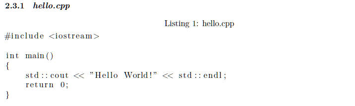
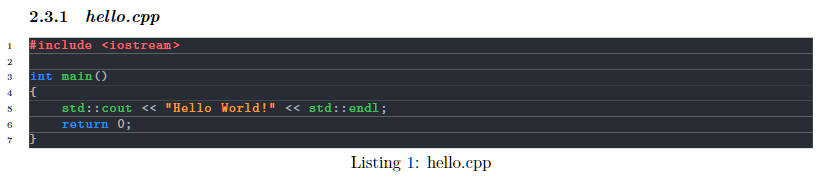

# XJTLU-TC Latex Coursework Template
> Version: 0.0.1

- This is a latex template for XJTLU-TC coursework created by *Taimingwang Liu*. :tada:
- Please :star:`STAR` this repository if you find it useful!!! It's a great encouragement for me! :wink:

## Why I create this template?
Inspired by [the excellent work](https://github.com/feimax/latex_template_for_xjtlu_eee_light) of *Dr.Cheng* and the EEE students of *XJTLU*, I'd like to make a template for **not so official** use.
Their template was once used for the doctoral thesis of *Dr.Cheng*, which is somehow too formal for coursework. :cry:
> Note: This template is not adopted by their project. :hushed:

## What's in this template?
### Many pre-defined commands
:unamused:As usual, we need to show a figure at current position with
```Latex
\begin{figure}[htbp]
    \centering
    \includegraphics[width=0.8\textwidth]{pics/figure_name}
    \caption{Figure caption}
    \label{fig:figure_label}
\end{figure}
```
:hushed:But it's too long to type, so I defined a command `picHere` to do the same thing:
```Latex
\picHere{pics/figure_name}{0.8\textwidth}{Figure caption}{fig:figure_label}
```

- TODO:More commands will be added in the future...

### Global Settings
At the beginning of this file, there are some parameters that can be changed to customize the report. These parameters can help users avoid changing the same settings in different files.:sunglasses:

1. Basic information: :+1:module name, student id...
2. Adjustment of the layout: :+1:title vertical offset, the content of header and footer...
3. Boolean variables: :+1:whether to use header and footer, whether to use MS Word page margin...

### Beautiful Code
`listings` and `Xcolor` packages are used, the code will be presented in my customized color scheme. (No longer black and white:wink:)

For this code:
```C++
#include <iostream>

int main()
{
    std::cout << "Hello World!" << std::endl;
    return 0;
}
```

:broken_heart:Before:



:heart:After:



## More
I'm still a newbie in Latex, so if you find any bugs or have any suggestions, please feel free to :mailbox:[contact me by email](mailto:SiriusLLLUUU@outlook.com) or :speech_balloon:create an issue!
I need your power to make this template better! :muscle:

## Acknowledgement
- :star:[Dr.Fei Cheng](https://github.com/feimax): A practitioner of *The Spirit Of Open Source*.
- :star:[Dr.Haochuan Jiang](https://github.com/falconjhc): My Latex torchbearer.